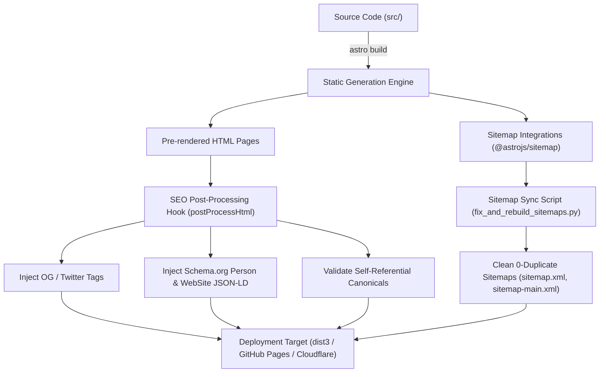

# Architecture Documentation

## 1. Core Architecture & Tech Stack

The application is built using a high-performance static site generator (SSG) architecture designed for zero server latency, maximum security, and search engine optimization.

* **Core Framework:** Astro 7.0.6 (Node.js ≥ 22.12.0)
* **Rendering Paradigm:** 100% Static HTML pre-rendering (`SSG`) with zero hydration overhead on content pages.
* **Client-side Reactivity:** Minimal vanilla JavaScript modules and targeted React/Alpine components for real-time calculator calculations.
* **Styling System:** Vanilla CSS design tokens with custom HSL color palettes, responsive flexbox/grid containers, and mobile drawer navigation.

---

## 2. Directory & Component Architecture

```
weight-loss-calculator/
├── .agents/                      # AI Customizations, Rules & Skills
├── public/                       # Static public assets (favicons, sitemaps, robots.txt)
├── src/
│   ├── components/               # Reusable UI Components
│   │   ├── Header.astro          # Universal navigation header
│   │   ├── Footer.astro          # Site-wide E-E-A-T footer
│   │   └── CalculatorCard.astro  # Interactive calculation cards
│   ├── layouts/
│   │   └── BaseLayout.astro      # Master layout with SEO & Schema injection
│   ├── pages/                    # Astro routes & SSG page definitions
│   └── utils/
│       └── spaNavGuard.mjs       # Navigation guard preventing SPA router 404s
├── astro.config.mjs              # Astro configuration, integrations & build hooks
├── fix_and_rebuild_sitemaps.py   # Sitemap cleaning and synchronization engine
└── package.json                  # Node.js dependencies and script entries
```

---

## 3. Build & Deployment Lifecycle



---

## 4. SPA Navigation Guard (`spaNavGuard.mjs`)

To prevent client-side routing errors when navigating between static pages and client-hydrated React calculator components, an inline SPA navigation guard is injected before `</body>`. If a client router attempts to load a non-existent SPA chunk, the guard seamlessly fallbacks to standard native browser HTTP navigation.

---

## 5. Sitemap & SEO Subsystem

* **Index Structure:** `sitemap-index.xml` acts as the root index referencing 6 modular sub-sitemaps (`sitemap-main.xml`, `sitemap-calculators.xml`, `sitemap-restaurants.xml`, `sitemap-compare.xml`, `sitemap-categories.xml`, `sitemap-international.xml`).
* **Sitemap Cleanliness:** Automated script `fix_and_rebuild_sitemaps.py` guarantees 0 duplicate `<loc>` tags across index and sub-sitemaps.
* **XSL Rendering:** Custom `sitemap.xsl` transforms raw XML sitemaps into clean, human-readable HTML tables in all browsers.
